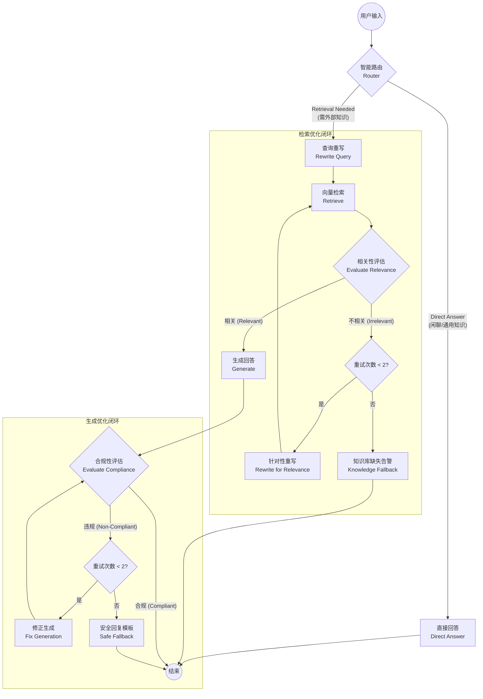

# Agentic RAG 架构设计与流程详解

本文档详细介绍了 Agentic RAG（Agentic Retrieval-Augmented Generation）系统的架构设计、核心流程以及优化策略。该系统旨在通过引入智能代理（Agent）的决策与自我修正能力，解决传统 RAG 系统在准确性、相关性和安全性方面面临的挑战。

## 1. 核心设计目标

* **智能路由**：根据用户查询的类型（如闲聊 vs. 专业问题），动态选择处理路径，避免不必要的检索开销。
* **检索质量保障**：通过相关性评估与查询重写闭环，确保送入生成模型的上下文是高度相关的，减少幻觉。
* **生成合规性与安全性**：引入生成后评估机制，自动检测并修正敏感、违规或事实错误的内容，确保输出安全可靠。
* **鲁棒性**：提供多级降级（Fallback）策略，在检索失败或生成失败时仍能给出得体的响应。

## 2. 系统流程图

下图展示了 Agentic RAG 的完整工作流，包括路由、检索优化闭环和生成优化闭环。

## 3. 流程详解

### 3.1 阶段一：智能路由 (Routing)

* **节点**: `router`
* **功能**: 分析用户查询意图，决定后续处理流程。
* **逻辑**:
  * **Direct (直接回答)**: 适用于问候（如"你好"）、身份询问（"你是谁"）或简单的通用常识问题。此路径不消耗检索资源，响应速度快。
  * **Rewrite (进入检索流)**: 适用于需要外部知识库支持的专业问题、模糊查询或特定领域问题。

### 3.2 阶段二：检索与优化 (Retrieval & Optimization)

此阶段的目标是获取高质量的上下文信息，如果检索结果不佳，系统会自动尝试优化查询。

* **查询重写 (`rewrite`)**:
  * 在首次检索前执行。
  * **策略**: Query Expansion（查询扩展）。补充同义词、领域术语，将简短的查询扩展为更适合向量检索的形式。
* **向量检索 (`retrieve`)**:
  * 使用重写后的查询在向量数据库中检索 Top-K 文档。
* **相关性评估 (`evaluate_relevance`)**:
  * **输入**: 用户原始查询 + 检索到的文档摘要。
  * **模型行为**: LLM 判断文档是否包含回答问题所需的信息。
  * **输出**: `relevant` 或 `irrelevant`。
* **优化闭环**:
  * 如果判定为 **不相关**，且重试次数未达上限（默认 2 次），进入 **针对性重写 (`rewrite_relevance`)**。
  * 重写策略：基于“检索失败”的事实，尝试完全不同的关键词组合或放宽约束条件。
* **知识库缺失降级 (`knowledge_fallback`)**:
  * 如果经过 2 次重试仍未检索到相关文档，系统判定知识库缺失。
  * **动作**: 停止流程，直接返回“抱歉，知识库中未找到相关信息”，避免强行生成导致幻觉。

### 3.3 阶段三：生成与合规 (Generation & Compliance)

此阶段的目标是基于上下文生成回答，并确保回答的安全性和合规性。

* **生成回答 (`generate`)**:
  * 基于通过相关性评估的文档作为 Context，结合对话历史生成回答。
  * Prompt 约束：优先使用上下文，无法回答时明确说明。
* **合规性评估 (`evaluate_compliance`)**:
  * **输入**: 生成的回答。
  * **检查维度**:
    1. **敏感词检测**: 政治敏感、暴力恐怖等。
    2. **合法性检测**: 是否包含违法建议。
    3. **事实一致性**: 是否包含明显的逻辑矛盾或反常识信息。
  * **输出**: `compliant` 或包含具体违规点的列表。
* **修正闭环**:
  * 如果发现违规，且重试次数未达上限（默认 2 次），进入 **修正生成 (`fix_generation`)**。
  * **修正 Prompt**: 携带具体的违规原因（如“包含敏感表述”），要求 LLM 进行针对性修改（删除、重写或补充）。
* **安全降级 (`fallback_safe`)**:
  * 如果经过 2 次修正仍无法通过合规检查，系统触发熔断。
  * **动作**: 返回标准的安全回复模板（如“抱歉，无法提供该信息”），确保不输出有害内容。

## 4. 关键优化技术总结

| 优化技术                               | 对应模块                                        | 作用                                                 |
| :------------------------------------- | :---------------------------------------------- | :--------------------------------------------------- |
| **Query Routing**                | `router`                                      | 提高效率，区分闲聊与专业问答。                       |
| **Query Expansion**              | `rewrite`                                     | 解决用户提问词汇与文档词汇不匹配的问题（词汇鸿沟）。 |
| **Self-Correction (Retrieval)**  | `evaluate_relevance` -> `rewrite_relevance` | 自动纠正检索失败，提升召回率。                       |
| **Self-Correction (Generation)** | `evaluate_compliance` -> `fix_generation`   | 自动纠正内容违规，提升安全性。                       |
| **Graceful Fallback**            | `knowledge_fallback`, `fallback_safe`       | 避免“强行回答”导致的幻觉和不可控输出。             |
