# 从零构建 Agentic RAG 系统：全栈开发实战指南

**作者**: Trae AI Assistant
**版本**: 1.0
**适用对象**: 具备 Python 与 RESTful API 开发基础，希望掌握 RAG 与 Agent 开发的工程师。

---

## 📖 目录

1. [第1章：项目启航 —— 环境搭建与规范制定](#第1章项目启航--环境搭建与规范制定)
2. [第2章：蓝图设计 —— Agentic RAG 架构解析](#第2章蓝图设计--agentic-rag-架构解析)
3. [第3章：数据基石 —— Weaviate 向量数据库实战](#第3章数据基石--weaviate-向量数据库实战)
4. [第4章：接入智慧 —— SiliconCloud LLM 服务集成](#第4章接入智慧--siliconcloud-llm-服务集成)
5. [第5章：语义理解 —— 嵌入模型与向量化流水线](#第5章语义理解--嵌入模型与向量化流水线)
6. [第6章：文档解析 —— 多格式数据摄入管道](#第6章文档解析--多格式数据摄入管道)
7. [第7章：RAG 核心 —— 混合检索策略实现](#第7章rag-核心--混合检索策略实现)
8. [第8章：对话管理 —— 会话状态与上下文注入](#第8章对话管理--会话状态与上下文注入)
9. [第9章：Agent 编排 —— 引入 LangGraph 构建决策流](#第9章agent-编排--引入-langgraph-构建决策流)
10. [第10章：API 网关 —— FastAPI 接口设计与实现](#第10章api-网关--fastapi-接口设计与实现)
11. [第11章：稳健工程 —— 熔断降级与错误重试](#第11章稳健工程--熔断降级与错误重试)
12. [第12章：部署运维 —— Docker 容器化与交付](#第12章部署运维--docker-容器化与交付)
13. [第13章：质量保障 —— 自动化测试体系](#第13章质量保障--自动化测试体系)

---

## 第1章：项目启航 —— 环境搭建与规范制定

### 1.1 场景问题

在开始编码之前，我们需要一个干净、可复现的开发环境。Python 项目常见的依赖冲突问题往往导致“在我机器上能跑”的尴尬。本章解决工程初始化问题。

### 1.2 设计思路

- **包管理**: 使用 `uv` (比 pip 更快) 或标准 `venv`。
- **依赖管理**: 锁定 `requirements.txt`。
- **配置管理**: 使用 `pydantic-settings` + `.env` 实现配置与代码分离。

### 1.3 实现步骤

1. 创建项目目录结构。
2. 初始化虚拟环境。
3. 安装核心依赖库。

### 1.4 关键代码讲解

**目录结构**:

```text
AgenticRAG/
├── backend/
│   ├── app/
│   │   ├── config.py       # 全局配置
│   │   ├── main.py         # 入口文件
│   │   └── ...
│   ├── requirements.txt
│   └── .env                # 环境变量
└── docker-compose.yml
```

**backend/requirements.txt**:

```text
fastapi>=0.115.0
uvicorn>=0.30.0
pydantic-settings>=2.4.0
tenacity>=8.2.0           # 重试库
pybreaker>=0.7.0          # 熔断库
weaviate-client>=4.6.0    # 向量数据库客户端
langgraph>=0.2.0          # Agent编排
llama-index>=0.10.0       # RAG 框架
langchain-openai>=0.1.0   # OpenAI 兼容接口
python-multipart>=0.0.9   # 文件上传
```

**backend/app/config.py**:

```python
import os
from pydantic_settings import BaseSettings
from pydantic import Field

class Settings(BaseSettings):
    environment: str = Field(default="development")
    # SiliconCloud 配置
    siliconcloud_api_key: str = Field(default=os.getenv("SILICONCLOUD_API_KEY", ""))
    siliconcloud_model: str = Field(default="Qwen/Qwen2.5-14B-Instruct")
    # 向量库配置
    weaviate_url: str = Field(default="http://localhost:8080")
  
    class Config:
        env_file = ".env"
        extra = "ignore"
```

---

## 第2章：蓝图设计 —— Agentic RAG 架构解析

### 2.1 场景问题

传统 RAG 只是简单的 "Retrieve-then-Generate"，但在复杂场景下（如需要多步推理、澄清问题），线性流程显得力不从心。我们需要引入 Agent 概念。

### 2.2 设计思路

- **Agentic RAG**: 引入“决策”节点。模型不仅生成回答，还能决定“是否需要检索”、“检索关键词是什么”甚至“是否需要追问用户”。
- **架构分层**:
  - **数据层**: Weaviate (存储向量 + 文档)。
  - **服务层**: LLM (SiliconCloud), Embedding (Qwen)。
  - **Agent 层**: 编排检索、生成、决策逻辑。
  - **网关层**: FastAPI 暴露 REST 接口。

### 2.3 架构图 (文字版)

```mermaid
graph TD
    User[用户] --> API[FastAPI 网关]
    API --> Agent[Agent 编排层 LangGraph]
    Agent --> Decision{决策节点}
  
    Decision -->|需要检索| Retriever[检索器]
    Decision -->|直接回答| Generator[生成器]
  
    Retriever --> VectorDB[(Weaviate)]
    VectorDB --> Retriever
    Retriever --> Generator
    Generator --> API
```



---

## 第3章：数据基石 —— Weaviate 向量数据库实战

### 3.1 场景问题

RAG 的核心是“检索”。传统数据库无法高效处理语义相似度搜索。我们需要一个向量数据库。

### 3.2 设计思路

- 选用 **Weaviate**: 开源、高性能、支持混合检索。
- 部署方式: Docker Compose 本地部署。

### 3.3 实现步骤

1. 编写 `docker-compose.yml`。
2. 启动 Weaviate 服务。
3. 编写 Python 客户端连接代码。

### 3.4 关键代码讲解

**docker-compose.yml**:

```yaml
services:
  weaviate:
    command:
    - --host
    - 0.0.0.0
    - --port
    - '8080'
    - --scheme
    - http
    image: cr.weaviate.io/semitechnologies/weaviate:1.35.3
    ports:
    - 8080:8080
    - 50051:50051
    environment:
      QUERY_DEFAULTS_LIMIT: 25
      AUTHENTICATION_ANONYMOUS_ACCESS_ENABLED: 'true'
      PERSISTENCE_DATA_PATH: '/var/lib/weaviate'
      # 禁用内置模块，使用外部 Embedding 服务
      ENABLE_MODULES: '' 
```

**backend/app/rag/vector_store.py** (初始化):

```python
import weaviate
from ..config import Settings

_settings = Settings()

def get_weaviate_client():
    # 连接本地 Weaviate
    return weaviate.connect_to_local(
        port=8080,
        grpc_port=50051
    )
```

---

## 第4章：接入智慧 —— SiliconCloud LLM 服务集成

### 4.1 场景问题

我们需要一个强大的大脑来理解查询和生成回答。SiliconCloud 提供了高性价比的 Qwen/DeepSeek 等模型 API。

### 4.2 设计思路

- **兼容性**: SiliconCloud 兼容 OpenAI 接口协议。
- **适配器模式**: 使用 LlamaIndex 的 `CustomLLM` 或 LangChain 的适配器封装 API 调用。

### 4.3 实现步骤

1. 获取 API Key。
2. 封装 `SiliconCloudLLM` 类。

### 4.4 关键代码讲解

**backend/app/services/llm_siliconcloud.py**:

```python
from langchain.chat_models import init_chat_model
from llama_index.core.llms import CustomLLM
from llama_index.core import Settings as LlamaSettings

class SiliconCloudLLM:
    def __init__(self, settings):
        # 初始化 LangChain Chat Model
        self.chat_model = init_chat_model(
            model=settings.siliconcloud_model,
            model_provider="openai",
            api_key=settings.siliconcloud_api_key,
            base_url=f"{settings.siliconcloud_base_url}/v1",
            temperature=0.2
        )
      
    def complete(self, prompt: str) -> str:
        # 调用模型生成回答
        try:
            from langchain_core.messages import HumanMessage
            msg = HumanMessage(content=prompt)
            out = self.chat_model.invoke([msg])
            return str(out.content)
        except Exception as e:
            return f"Error: {e}"
```

---

## 第5章：语义理解 —— 嵌入模型与向量化流水线

### 5.1 场景问题

文本需要转换为向量（Embeddings）才能进行数学计算。我们需要集成 `Qwen/Qwen3-Embedding-8B` 模型。

### 5.2 设计思路

- **Embedding 模型**: 负责将 `str` -> `List[float]`。
- **LlamaIndex 集成**: 使用 `LangchainEmbedding` 包装 `OpenAIEmbeddings`。

### 5.3 实现步骤

1. 在配置中指定 Embed 模型。
2. 在 LLM 初始化时加载 Embed 模型。
3. 在向量入库时生成向量。

### 5.4 关键代码讲解

**backend/app/services/llm_siliconcloud.py** (追加):

```python
from langchain_openai import OpenAIEmbeddings
from llama_index.embeddings.langchain import LangchainEmbedding

# 在 __init__ 中：
if settings.siliconcloud_embed_model:
    embed_model = OpenAIEmbeddings(
        model=settings.siliconcloud_embed_model,
        api_key=settings.siliconcloud_api_key,
        base_url=f"{settings.siliconcloud_base_url}/v1"
    )
    # 设置全局 Embed 模型
    LlamaSettings.embed_model = LangchainEmbedding(langchain_embeddings=embed_model)
```

**backend/app/rag/vector_store.py** (向量化):

```python
def upsert_documents(self, docs: List[Dict]):
    # 批量生成向量
    texts = [d["text"] for d in docs]
    vectors = LlamaSettings.embed_model.get_text_embedding_batch(texts)
  
    # 批量入库
    with self.client.batch.dynamic() as batch:
        for i, d in enumerate(docs):
            batch.add_object(
                properties={"text": d["text"], "source": d["source"]},
                vector=vectors[i],
                collection=self.class_name
            )
```

---

## 第6章：文档解析 —— 多格式数据摄入管道

### 6.1 场景问题

用户上传的文件往往是多种多样的（PDF, Word, Markdown, Txt），且可能包含多个文件。我们需要一个健壮的解析器，不仅能处理不同格式，还要考虑文件大小限制和异常处理。

### 6.2 设计思路

- **批量处理**: 接口接收 `List[UploadFile]`，支持一次上传多个文档。
- **格式分发**: 根据文件后缀名路由到不同的解析逻辑。
  - **.pdf**: 使用 `PyPDF2` 提取每页文本。
  - **.docx**: 使用 `python-docx` 提取段落文本。
  - **.md/.txt**: 直接进行 UTF-8 解码。
- **安全限制**: 增加 10MB 文件大小限制，防止内存溢出。
- **容错处理**: 对无法解析的文件记录错误但不中断整个批次。

### 6.3 关键代码讲解

**backend/app/rag/document_loader.py**:

```python
from typing import List, Dict
from fastapi import UploadFile, HTTPException
import io

# 引入解析库，需确保 requirements.txt 已包含 PyPDF2 和 python-docx
try:
    from PyPDF2 import PdfReader
    from docx import Document
except ImportError:
    pass

async def parse_files(files: List[UploadFile]) -> List[Dict]:
    docs = []
    for f in files:
        name = (f.filename or "unknown").lower()
        
        # 1. 格式校验
        if not (name.endswith(".md") or name.endswith(".pdf") or name.endswith(".docx") or name.endswith(".txt")):
            raise HTTPException(status_code=400, detail="仅支持上传 md/pdf/docx/txt 文件")
            
        # 2. 读取内容与大小校验
        content = await f.read()
        if len(content) > 10 * 1024 * 1024: # 10MB limit
            raise HTTPException(status_code=413, detail=f"文件 {name} 过大（>10MB）")
            
        text = ""
        try:
            # 3. 分格式解析
            if name.endswith(".pdf"):
                reader = PdfReader(io.BytesIO(content))
                text = "\n".join([page.extract_text() or "" for page in reader.pages])
            elif name.endswith(".docx"):
                doc = Document(io.BytesIO(content))
                text = "\n".join([p.text for p in doc.paragraphs])
            else:
                # md 或 txt
                text = content.decode("utf-8", errors="ignore")
        except Exception as e:
            # 解析失败记录日志或忽略，这里简单处理为空
            print(f"Failed to parse {name}: {e}")
            continue

        if text.strip():
            docs.append({"text": text, "source": f.filename or "unknown"})
            
    return docs
```

---

## 第7章：RAG 核心 —— 混合检索策略实现

### 7.1 场景问题

单纯的向量检索（Dense Retrieval）在匹配精确关键词（如产品型号）时效果不佳；关键词检索（BM25）在语义理解上不足。

### 7.2 设计思路

- **混合检索 (Hybrid Search)**: 结合 Vector Search + Keyword Search (BM25)。
- **降级策略**: 如果向量服务不可用，自动回退到 BM25。

### 7.3 关键代码讲解

**backend/app/rag/vector_store.py**:

```python
def query(self, query_text: str, top_k: int):
    collection = self.client.collections.get(self.class_name)
    try:
        # 尝试向量检索
        query_vec = LlamaSettings.embed_model.get_query_embedding(query_text)
        return collection.query.near_vector(near_vector=query_vec, limit=top_k)
    except Exception as e:
        # 降级到 BM25
        logger.warning(f"Vector search failed, fallback to BM25: {e}")
        return collection.query.bm25(query=query_text, limit=top_k)
```

---

## 第8章：对话管理 —— 会话状态与上下文注入

### 8.1 场景问题

RAG 系统需要支持多轮对话。用户可能会说“能详细解释一下第二点吗？”，系统必须知道“第二点”指的是上一轮回答中的内容。此外，Web 服务是并发的，需要确保会话状态的线程安全。

### 8.2 设计思路

- **Session 对象**: 使用 `dataclass` 定义会话结构，包含 `id`、`history` 和 `metadata`。
- **线程安全存储**: 使用 `SessionStore` 类管理所有会话，并使用 `threading.Lock` 保护字典的读写操作，防止并发竞争。
- **单例模式**: 全局共享一个 `SessionStore` 实例。

### 8.3 关键代码讲解

**backend/app/services/session.py**:

```python
from typing import Dict, List
from dataclasses import dataclass, field
import threading

@dataclass
class Session:
    id: str
    # 存储对话历史，格式为 [{"role": "user", "content": "..."}, ...]
    history: list = field(default_factory=list)
    # 可扩展字段，如存储用户偏好
    metadata: dict = field(default_factory=dict)

class SessionStore:
    def __init__(self):
        # 线程锁，确保并发安全
        self._lock = threading.Lock()
        self._sessions: Dict[str, Session] = {}

    def get_or_create(self, session_id: str) -> Session:
        with self._lock:
            if session_id not in self._sessions:
                self._sessions[session_id] = Session(id=session_id)
            return self._sessions[session_id]

# 全局单例
_store = SessionStore()

def get_session_store():
    return _store
```

---

## 第9章：Agent 编排 —— 引入 LangGraph 构建决策流

### 9.1 场景问题

如何让系统更智能？例如，当检索结果为空时，不是胡乱回答，而是诚实地说“不知道”或者尝试通过网络搜索（Tool use）。此外，我们还需要确保回答的准确性和安全性，防止幻觉和违规内容。

### 9.2 设计思路

- **LangGraph**: 定义图结构 `StateGraph`。
- **高级决策流**:
  - **Router**: 意图识别，区分闲聊（Direct Answer）与知识问答（RAG）。
  - **Rewrite**: 查询重写，优化检索关键词。
  - **Relevance Evaluation**: 检索后相关性评估，不相关则触发重试或知识库缺失告警。
  - **Compliance Evaluation**: 生成后合规性检查，自动修正敏感或违规内容。
- **闭环优化**: 包含 "Retrieve-Evaluate-Rewrite-Loop" 和 "Generate-Evaluate-Fix-Loop" 双重闭环。

### 9.3 关键代码讲解

**backend/app/rag/pipeline.py**:

```python
from langgraph.graph import StateGraph, END

class AgentPipeline:
    def _build_graph(self):
        workflow = StateGraph(AgentState)
        
        # 核心节点
        workflow.add_node("router", self._router)           # 意图路由
        workflow.add_node("rewrite", self._rewrite)         # 查询重写
        workflow.add_node("retrieve", self._retrieve)       # 文档检索
        workflow.add_node("generate", self._generate)       # 答案生成
        
        # 评估与优化节点
        workflow.add_node("evaluate_relevance", self._evaluate_relevance)   # 相关性评估
        workflow.add_node("rewrite_relevance", self._rewrite_relevance)     # 检索失败重写
        workflow.add_node("knowledge_fallback", self._knowledge_fallback)   # 知识缺失兜底
        workflow.add_node("evaluate_compliance", self._evaluate_compliance) # 合规性评估
        workflow.add_node("fix_generation", self._fix_generation)           # 违规修正
        workflow.add_node("fallback_safe", self._fallback_safe)             # 安全降级
        
        # 定义流转逻辑
        workflow.set_entry_point("router")
        
        # 1. 路由分支
        workflow.add_conditional_edges(
            "router",
            self._route_decision,
            {
                "direct": "direct_answer",
                "rewrite": "rewrite"
            }
        )
        
        # 2. 检索闭环 (Rewrite -> Retrieve -> Eval -> Rewrite)
        def check_relevance(state):
            if state.get("is_relevant"):
                return "generate"
            elif state.get("retrieve_count", 0) < 2:
                return "rewrite_relevance" # 重试
            else:
                return "knowledge_fallback" # 放弃

        workflow.add_conditional_edges(
            "evaluate_relevance", 
            check_relevance,
            {"generate": "generate", "rewrite_relevance": "rewrite_relevance", "knowledge_fallback": "knowledge_fallback"}
        )
        
        # 3. 生成闭环 (Generate -> Eval -> Fix -> Generate)
        def check_compliance(state):
            if not state.get("compliance_issues"):
                return "end"
            elif state.get("generate_count", 0) < 2:
                return "fix"
            else:
                return "fallback"

        workflow.add_conditional_edges(
            "evaluate_compliance",
            check_compliance,
            {"end": END, "fix": "fix_generation", "fallback": "fallback_safe"}
        )

        return workflow.compile()
```

---

## 第10章：API 网关 —— FastAPI 接口设计与实现

### 10.1 场景问题

前端需要标准 HTTP 接口来交互。

### 10.2 设计思路

- **RESTful 风格**:
  - `POST /chat`: 发送消息，返回流式或非流式响应。
  - `POST /upload`: 上传文件。
  - `DELETE /session`: 清除会话。

### 10.3 关键代码讲解

**backend/app/routers/chat.py**:

```python
from fastapi import APIRouter, BackgroundTasks

router = APIRouter()

@router.post("/chat")
async def chat_endpoint(request: ChatRequest):
    # 1. 获取 Session
    # 2. 调用 Pipeline
    response = agent.run(request.query, session_id=request.session_id)
    return {"answer": response["answer"], "sources": response["sources"]}
```

---

## 第11章：稳健工程 —— 熔断降级与错误重试

### 11.1 场景问题

外部 API (SiliconCloud) 可能会抖动、超时。不能让用户的请求直接挂死。

### 11.2 设计思路

- **Retry (重试)**: 使用 `tenacity`，对网络错误进行指数退避重试。
- **Circuit Breaker (熔断)**: 使用 `pybreaker`，当错误率达到阈值时，暂停调用，直接返回降级响应。

### 11.3 关键代码讲解

**backend/app/utils/retry.py**:

```python
from tenacity import retry, stop_after_attempt, wait_exponential

@retry(stop=stop_after_attempt(3), wait=wait_exponential(multiplier=1, min=4, max=10))
def reliable_call_llm(llm, prompt):
    return llm.complete(prompt)
```

---

## 第12章：部署运维 —— Docker 容器化与交付

### 12.1 场景问题

如何一键交付给其他开发者或部署到服务器？

### 12.2 设计思路

- **Dockerfile**: 构建后端镜像。
- **Docker Compose**: 编排 Backend + Weaviate。

### 12.3 关键代码讲解

**backend/Dockerfile**:

```dockerfile
FROM python:3.10-slim
WORKDIR /app
COPY requirements.txt .
RUN pip install --no-cache-dir -r requirements.txt
COPY . .
CMD ["uvicorn", "app.main:app", "--host", "0.0.0.0", "--port", "8000"]
```

---

## 第13章：质量保障 —— 自动化测试体系

### 13.1 场景问题

每次修改代码后，如何确保没有破坏现有功能？

### 13.2 设计思路

- **单元测试**: 测试独立的函数（如文档解析）。
- **集成测试**: 测试 LLM + VectorDB 的完整流程（使用真实或 Mock 组件）。

### 13.3 关键代码讲解

**test_embedding_flow.py** (集成测试):

```python
def test_rag_flow():
    # 1. 准备数据
    docs = [{"text": "测试文档内容", "source": "test.txt"}]
    # 2. 插入向量库
    vs.upsert_documents(docs)
    # 3. 执行查询
    results = vs.query("测试", top_k=1)
    # 4. 断言
    assert len(results) > 0
    assert "测试文档内容" in results[0]["text"]
```

---

## 结语

至此，我们已经完成了一个工业级 Agentic RAG 系统的核心构建。从环境配置到架构设计，再到具体的代码实现与测试部署，这个系统具备了可扩展、高可用和智能化的特点。你可以在此基础上继续扩展，例如添加 Web Search 工具、增加多模态支持或优化 Prompt Engineering。
