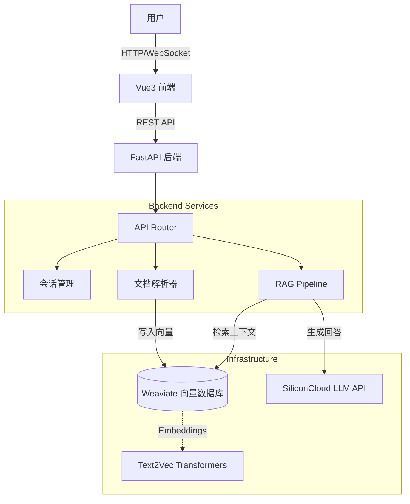

# 系统架构文档 (System Architecture)

本文档详细描述了 Agentic RAG 系统的架构设计、核心组件交互及数据流向。

## 1. 架构概览

本系统采用经典的前后端分离架构，后端遵循微服务设计原则（尽管目前为单体应用，但模块边界清晰），核心围绕 **检索增强生成 (RAG)** 范式构建。

## 2. 核心组件

### 2.1 前端 (Frontend)

- **技术栈**: Vue 3, Vite, TailwindCSS
- **职责**:
  - 提供用户交互界面（聊天窗口、文件上传面板）。
  - 维护会话状态（Session ID）。
  - 调用后端 API 并渲染 Markdown 格式的回复。
- **关键组件**:
  - `ChatBox.vue`: 负责消息列表展示与流式/非流式响应处理。
  - `UploadPanel.vue`: 处理文件选择与上传进度反馈。

### 2.2 后端 (Backend)

- **技术栈**: FastAPI, Python 3.10+
- **模块划分**:
  - **Routers**: `chat.py` (对话), `upload.py` (上传), `admin.py` (管理)。
  - **Services**: `llm_siliconcloud.py` (LLM 适配), `session.py` (内存级会话存储)。
  - **RAG Core**:
    - `pipeline.py`: 定义 Agent 执行流（检索 -> 规划 -> 生成）。
    - `vector_store.py`: Weaviate 客户端封装，处理 Schema 定义与 CRUD。
    - `document_loader.py`: 多格式文档解析工厂。
  - **Utils**: 日志、重试装饰器 (`retry.py`)、配置管理。

### 2.3 基础设施 (Infrastructure)

- **Weaviate**: 开源向量数据库，用于存储文档块及其向量嵌入。
- **Text2Vec Transformers**: 独立的 Docker 服务，为 Weaviate 提供本地向量化能力（避免依赖外部 Embedding API，降低延迟与成本）。
- **SiliconCloud API**: 提供高性能大语言模型推理服务（如 Qwen2.5, DeepSeek）。

## 3. 关键业务流程

### 3.1 文档上传与索引流程

1. 用户上传文件 (PDF/MD/Docx)。
2. 后端 `upload` 接口接收文件流。
3. `document_loader` 识别文件类型并提取纯文本。
4. 文本被分块（Chunking）并发送至 `Weaviate`。
5. `Weaviate` 调用 `text2vec-transformers` 生成向量并持久化存储。

### 3.2 智能问答流程 (RAG)

1. 用户发送查询 `Query`。
2. **Retrieve (检索)**:
   - 系统将 `Query` 向量化，在 Weaviate 中进行语义搜索。
   - 获取 Top-K (默认 4) 最相关文档块。
3. **Augment (增强)**:
   - 将检索到的文档块作为 Context，拼接 Prompt。
   - Prompt 模板: `基于以下上下文 {context} 回答问题 {query}`。
4. **Generate (生成)**:
   - 调用 SiliconCloud LLM API 生成回答。
   - 如遇超时或 API 错误，触发 `retry` 机制；连续失败触发熔断。
5. **Response (响应)**:
   - 结果返回前端，包含 Answer 和参考源 Sources。

## 4. 关键设计决策

### 4.1 容错与稳定性

- **重试机制 (Retry)**: 针对 LLM API 调用使用了 `tenacity` 库，网络抖动或临时 5xx 错误会自动重试。
- **熔断机制 (Circuit Breaker)**: 使用 `pybreaker`。当 LLM 服务连续失败达到阈值时，暂时切断请求，直接返回降级响应，防止系统雪崩。
- **超时控制**: 所有外部 API 调用均设置严格超时（默认 60s），确保端到端响应时间可控。

### 4.2 模块化 Agent 设计

- 代码中预留了 `langgraph` 集成接口 (`build_langgraph`)。
- 默认使用轻量级 `AgentPipeline` 类，但在逻辑上遵循 `Retrieve -> Decide -> Generate` 的图式结构，方便未来扩展为更复杂的 ReAct Agent 或多步推理 Agent。

### 4.3 安全性设计

- **文件安全**: 上传文件名标准化，限制文件类型白名单，防止恶意脚本上传。
- **环境隔离**: 敏感密钥 (API Key) 仅通过环境变量注入，不在代码库硬编码。
- **HTTP 安全**: 生产环境建议开启 HTTPS，配置 CORS 白名单，添加安全响应头 (HSTS, CSP)。

## 5. 部署架构

支持 Docker Compose 全栈部署：

- `backend`: Python 服务，端口 8000
- `frontend`: Nginx/Node 服务，端口 3000
- `weaviate`: 向量库，端口 8080
- `t2v-transformers`: 向量模型服务

各服务通过 Docker 网络 `agentic-rag-net` 互通，对外只暴露应用端口。
